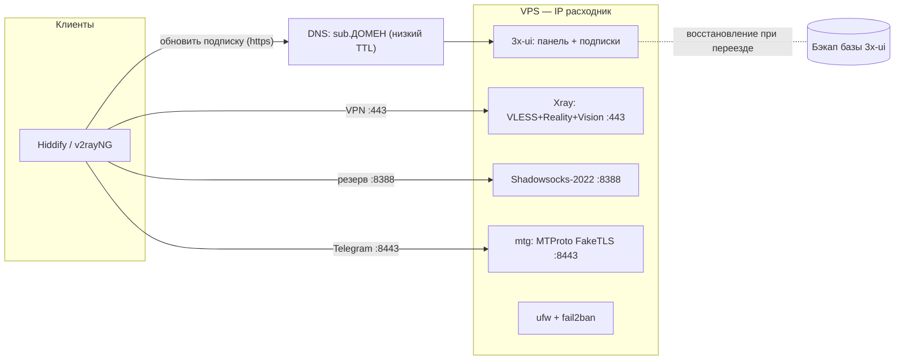

# Архитектура Mirage

Документ описывает состав Mirage, сетевые потоки и модель переноса на новый VPS
без ручной перенастройки клиентов.

## Цели и приоритеты

1. **Рабочий сервис** — VPN и Telegram-прокси, которые реально проходят DPI в
   обычном режиме фильтрации.
2. **Безболезненная миграция** — смена сервера/IP не требует ручной
   перенастройки клиентов. Блокировки происходят регулярно, поэтому IP считаем
   расходником.

Чего проект сознательно **не** решает: полный режим «белого списка» (drop-all) на
мобильном интернете — там зарубежный VPS не проходит по IP-проверке (L3). См.
раздел о пределах фильтрации в [документе установки](setup.md).

## Принципы

- **IP — расходник.** Не боремся за конкретный сервер, а делаем замену быстрой.
- **Единый источник правды для клиентов** — subscription-ссылка, а не голый конфиг.
- **Infrastructure as Code (поэтапно)** — настройка сервера кодифицируется в
  Ansible; provisioning через Terraform — в будущих версиях (ADR-0006).
- **Least privilege** — открыто только необходимое; секреты не в гите.

## Компоненты

| Компонент | Роль | Где живёт |
|---|---|---|
| VPS (Ubuntu/Debian) | Хост с публичным IP | reseller-VPS, ручная выдача |
| Xray-core | Движок VLESS + Reality + XTLS-Vision | systemd на VPS |
| 3x-ui | Панель управления + выдача подписок | systemd на VPS |
| Shadowsocks-2022 | Резервный протокол | inbound в Xray |
| mtg | Telegram MTProto, режим FakeTLS | Docker на VPS |
| ufw + fail2ban | Фаервол и защита от брутфорса | systemd на VPS |
| Домен + DNS | Стабильный адрес подписки | внешний DNS (напр. Cloudflare) |
| Ansible | Bootstrap доступа и базовая защита; позже настройка сервисов | первый этап запускается на VPS |
| Terraform | Провижининг VPS (отложено, будущие версии) | локально |

## Сетевые потоки и порты

| Порт | Протокол | Назначение |
|---|---|---|
| 22/tcp | SSH | управление сервером (по ключам) |
| 443/tcp | VLESS + Reality | основной VPN-трафик |
| 8388/tcp | Shadowsocks-2022 | резервный VPN-трафик |
| 8443/tcp | MTProto FakeTLS | Telegram через mtg |
| случайный | HTTP на localhost | панель 3x-ui (закрыта, доступ через SSH-туннель) |

Путь пакета клиента: клиентское приложение открывает соединение на `443` → для
провайдера это обычный HTTPS к разрешённому сайту (заслуга Reality) → Xray на VPS
расшифровывает и выпускает трафик в интернет от имени сервера.

## Маскировка трафика

- **Reality (VPN).** В TLS-рукопожатии поле **SNI** содержит безобидный домен
  (на первом рабочем inbound используется `vk.ru`). Для DPI соединение
  неотличимо от захода на этот сайт. **XTLS-Vision** усиливает стойкость к
  активному зондированию.
- **FakeTLS (Telegram).** mtg заворачивает MTProto в TLS под видом `vk.ru` —
  разрешённого в РФ домена. Для DPI это визит на ВКонтакте.

Подробно про установку и проверки — в [документе установки](setup.md).

## Дизайн миграции без потерь

Выбранная модель: **подписку раздаёт сам VPS** через 3x-ui, а клиенты используют
ссылку на **домене**, а не на IP.

```
Клиент → https://sub.ДОМЕН/<id> → DNS (A-запись) → IP активного VPS → 3x-ui отдаёт свежий конфиг
```

### Что обеспечивает переезд

1. **Домен для подписки.** Клиенты получают ссылку вида `https://sub.ДОМЕН/...`.
   Она не меняется никогда. Меняется только то, на какой IP смотрит DNS.
2. **Низкий TTL DNS.** A-запись `sub.ДОМЕН` держим с коротким TTL (60–300 с),
   чтобы переключение применялось быстро. Удобно через Cloudflare.
   ⚠️ Запись для VPN/подписки в Cloudflare — в режиме **DNS only** (серое облако):
   проксировать Reality/произвольный TCP через Cloudflare нельзя.
3. **Бэкап конфигурации панели.** 3x-ui хранит состояние в SQLite (`x-ui.db`) или
   PostgreSQL — там клиенты, UUID, inbound'ы и параметры Reality. Регулярный бэкап
   базы и конфигурации позволяет восстановить **идентичный** набор клиентов на
   новом сервере.
4. **Воспроизводимая настройка (Ansible).** Сам сервер покупается у ритейлера
   вручную (API нет), но базовый SSH-доступ и защита уже воспроизводятся
   Ansible'ом. Установка сервисов будет добавляться поэтапно; provisioning через
   Terraform отложен (ADR-0006).

### Сценарий «сервер забанили»

1. Купить новый VPS у ритейлера (вручную) — получить новый IP.
2. `ansible-playbook` — восстановить базовый доступ, `ufw` и `fail2ban`.
3. Установить 3x-ui/Xray по runbook'у или будущей Ansible-роли.
4. Восстановить базу 3x-ui из бэкапа → те же клиенты и UUID.
5. Переключить A-запись `sub.ДОМЕН` на новый IP.
6. Клиенты при следующем обновлении подписки автоматически переходят на новый
   сервер.

### Резерв на уровне протокола

Если режут именно Reality, но не весь сервер — клиенты переключаются на
профиль **Shadowsocks** (он в той же подписке). Это защита от блокировки
протокола, а миграция выше — защита от бана IP.

## Инфраструктура как код

Подход пересмотрен (ADR-0006): у выбранного reseller-VPS нет API, поэтому
**Terraform отложен** до будущих версий. Первый Ansible-bootstrap уже реализован:
он запускается прямо на VPS через локальный inventory (ADR-0007), создаёт
администратора по SSH-ключу и настраивает базовую защиту. Второй этап пройден
вручную и закреплён runbook'ом: 3x-ui/Xray, панель через SSH-туннель и VLESS
Reality на `443/tcp`. Следующая цель — кодифицировать этот этап в Ansible, затем
добавить Shadowsocks и mtg.

```
infra/
└── ansible/        — bootstrap доступа, ufw, fail2ban; позже Xray/3x-ui и mtg
                      (terraform/ — позже, при переезде на провайдера с API)
```

- **Ansible** отвечает на вопрос «что на сервере настроено» (идемпотентно). Уже
  покрыт первый слой: доступ, `ufw`, `fail2ban` и SSH-hardening. 3x-ui/Xray пока
  описан повторяемым runbook'ом.
- **Terraform** («какой сервер существует») вернётся с провайдером, у которого есть API.

## Безопасность

- SSH только по ключам, парольный вход отключён (`fail2ban` как доп. слой).
- `ufw` пропускает только нужные порты (least privilege).
- Панель 3x-ui не светим наружу: случайный порт, `listenIP=127.0.0.1`, секретный
  путь и доступ через SSH-туннель.
- Секреты (ключи Reality, FakeTLS-секрет, токены провайдера) — вне гита; в
  Ansible — через Vault.

## Наблюдаемость (план)

- `mtg` отдаёт метрики Prometheus из коробки; `node_exporter` — метрики хоста.
- Grafana — дашборды; Alertmanager шлёт алерт в Telegram при падении/бане.

## Схема



## Открытые вопросы

- Регистратор и сам домен для подписки `sub.ДОМЕН` (этап DNS).
- Стратегия и периодичность бэкапа базы 3x-ui и ключей Reality.
- Автоматизация ручного этапа 3x-ui/Xray через Ansible.

## Связанные решения

- [ADR-0002: стек VPN](adr/0002-vpn-stack-xray-reality.md)
- [ADR-0003: доставка через подписку и домен](adr/0003-subscription-delivery-and-migration.md)
- [ADR-0004: инфраструктура как код с самого начала](adr/0004-iac-from-the-start.md)
- [ADR-0005: провайдер VPS — Timeweb Cloud](adr/0005-vps-provider-timeweb.md) (заменён)
- [ADR-0006: ручной provisioning, Terraform отложен](adr/0006-manual-provisioning-defer-terraform.md)
- [ADR-0007: первый Ansible-bootstrap запускать прямо на VPS](adr/0007-ansible-bootstrap-on-vps.md)
