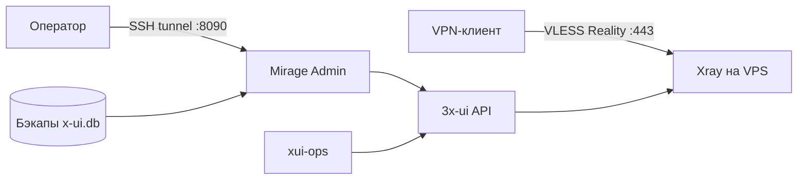

# Архитектура

Mirage v0.1 — это один VPS с Xray/3x-ui, локальной админ-панелью и
автоматизацией вокруг API 3x-ui. Система рассчитана на быстрый перенос на новый
VPS: IP считается расходником, а конфигурация хранится в бэкапах.

## Цели

- Поднять рабочий VPN на свежем VPS без ручной настройки каждого компонента.
- Держать публичным только нужный VPN-порт.
- Выдавать отдельные профили участникам.
- Делать backup и восстановление базы 3x-ui.
- Сохранить путь к миграции при блокировке IP.

## Компоненты

| Компонент | Роль |
|---|---|
| VPS | хост с публичным IP |
| Ansible | первый bootstrap доступа, `ufw`, `fail2ban`, SSH-hardening |
| 3x-ui | панель управления Xray и клиентами |
| Xray-core | VLESS Reality на `443/tcp` |
| xui-ops | CLI-автоматизация 3x-ui через API |
| Mirage Admin | локальная админ-панель для профилей, бэкапов и диагностики |
| backup timer | ежедневный backup базы 3x-ui |
| restore-helper | безопасное восстановление backup через root-helper |

## Порты

| Порт | Доступ | Назначение |
|---|---|---|
| `22/tcp` | публичный | SSH по ключу |
| `443/tcp` | публичный | VLESS Reality |
| `127.0.0.1:8090` | локальный | Mirage Admin |
| `127.0.0.1:ПОРТ_ПАНЕЛИ` | локальный | 3x-ui |

Порты `8388`, `8443`, `9443`, `2096` не входят в текущий публичный контур v0.1.
Deploy удаляет старые `ufw`-правила для этих портов.

## Сетевой поток

Клиент подключается к `SERVER_HOST_OR_DOMAIN:443`. Для DPI соединение выглядит
как TLS-трафик к Reality target. В текущей конфигурации по умолчанию используется
`www.amazon.com`; `www.microsoft.com` подходит как резервный кандидат.

Reality помогает против протокольной фильтрации и активного зондирования, но не
защищает сам IP VPS. Если IP заблокирован, нужен новый VPS и восстановление из
backup.

## Модель профилей

Deploy создаёт три базовых профиля:

- `main` — основной профиль владельца;
- `partner` — отдельный близкий профиль;
- `shared` — общий профиль для остальных.

Новые профили создаются через Mirage Admin или `xui-ops ensure-client`. Имена
профилей должны быть техническими: без ФИО, телефонов и личных данных.

## Секреты

Секретами считаются:

- `.env.local`;
- `access.md`;
- client links и subscription links;
- UUID, short IDs, Reality private key;
- API token, пароль панели и `WEB_BASE_PATH`;
- backup-файлы.

Эти данные не попадают в git. Generated-файлы лежат в
`/home/mirage/mirage-vpn/` с закрытыми правами.

## Backup и restore

3x-ui хранит рабочую конфигурацию в базе. Поэтому backup базы 3x-ui — главный
артефакт восстановления. Mirage добавляет:

- ежедневный `mirage-xui-backup.timer`;
- backup API в Mirage Admin;
- import backup;
- restore-заявки через `mirage-admin-restore.path`.

Restore временно прерывает VPN, поэтому на рабочем сервере его выполняют только
в окно обслуживания.

## Миграция

Базовый сценарий:

1. Поднять новый VPS через Ansible bootstrap.
2. Развернуть Mirage через `ops/vpn/deploy.sh`.
3. Восстановить backup базы 3x-ui.
4. Проверить `vpn-diagnose`, `443/tcp`, Admin API и клиент.
5. Обновить домен или выдать свежие профили.

Подробно: [миграция на новый VPS](runbooks/migrate-vps.md).

## План после v0.1

- Домен и стабильные subscription-ссылки.
- MTProxy/FakeTLS для Telegram.
- Более полный Ansible provisioning сервисов.
- Terraform при переходе к провайдеру с API.
- Расширенная наблюдаемость.

## Связанные документы

- [Развёртывание](deploy.md)
- [Эксплуатация](operations.md)
- [Release-check v0.1](release-v0.1.md)
- [ADR](adr/)
