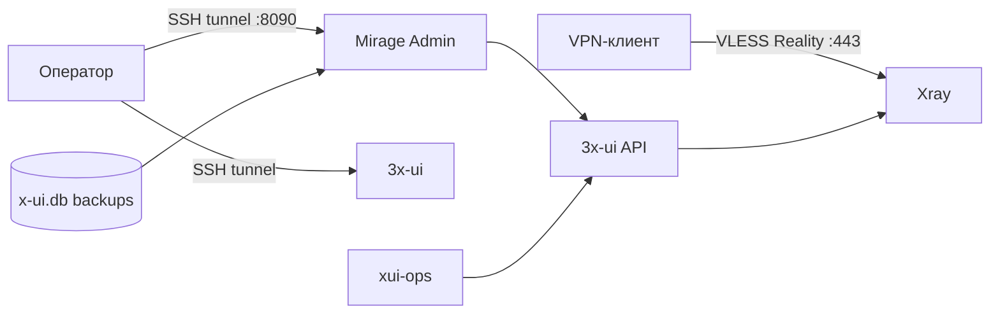

# Архитектура

Mirage v0.1 работает как один самодостаточный VPS. Публичным остаётся только
VPN-вход, а панели управления открываются через SSH-туннель.

## Схема

## Компоненты

| Компонент | Что делает |
|---|---|
| Ansible | готовит свежий VPS, SSH, `ufw`, `fail2ban` |
| 3x-ui | хранит inbound'ы, клиентов и параметры Xray |
| Xray | принимает VLESS Reality на `443/tcp` |
| xui-ops | автоматизирует 3x-ui через API |
| Mirage Admin | даёт локальную панель для профилей, бэкапов и диагностики |
| backup timer | ежедневно сохраняет базу 3x-ui |
| restore helper | восстанавливает backup с root-доступом |

## Порты

| Порт | Доступ | Назначение |
|---|---|---|
| `22/tcp` | публичный | SSH по ключу |
| `443/tcp` | публичный | VLESS Reality |
| `127.0.0.1:8090` | локальный | Mirage Admin |
| `127.0.0.1:ПОРТ_ПАНЕЛИ` | локальный | 3x-ui |

Порты админки и 3x-ui не открываются в `ufw`. Если они доступны снаружи, это
ошибка конфигурации.

## Профили

Deploy создаёт три профиля:

- `main` — основной профиль;
- `partner` — отдельный близкий профиль;
- `shared` — общий профиль.

Дополнительные профили создаются в Mirage Admin или через
`xui-ops ensure-client`. Используй технические имена без личных данных.

## Reality target

По умолчанию Mirage использует `www.amazon.com:443` как Reality target/SNI.
`www.microsoft.com:443` подходит как резервный кандидат.

Reality помогает маскировать TLS-профиль и снижает риск активного зондирования,
но не защищает сам IP VPS. Если IP заблокирован, сервер нужно заменить и
восстановить конфигурацию из backup.

## Backup и миграция

Главный артефакт восстановления — база 3x-ui. В ней находятся inbound'ы,
клиенты, UUID, Reality-параметры и short IDs.

Миграция выглядит так:

1. Поднять новый VPS.
2. Выполнить Ansible bootstrap.
3. Запустить `ops/vpn/deploy.sh`.
4. Импортировать актуальный backup через Mirage Admin.
5. Выполнить restore.
6. Проверить `443/tcp`, профили и клиентские приложения.

Подробные команды есть в [руководстве](guide.md).

## Что не входит в v0.1

- публичный subscription-домен;
- Telegram MTProxy/FakeTLS;
- Terraform provisioning;
- multi-node схема;
- автоматический failover.
