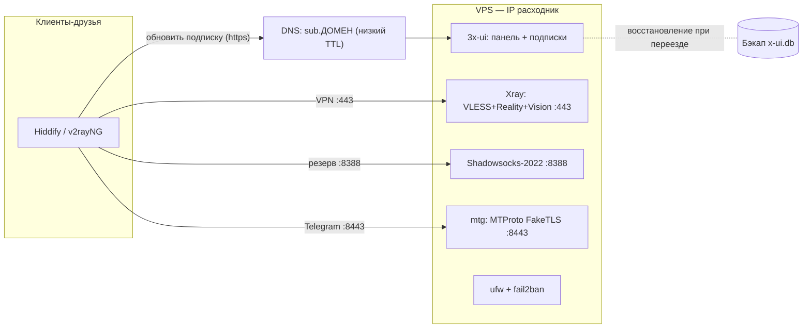

# Архитектура Mirage

Документ описывает, из чего состоит Mirage, как ходит трафик и — главное — как
устроен переезд на новый сервер без потерь для пользователей.

## Цели и приоритеты

1. **Рабочий сервис** — VPN и Telegram-прокси, которые реально проходят DPI в
   обычном режиме фильтрации.
2. **Безболезненная миграция** — смена сервера/IP не требует действий от друзей.
   Блокировки идут постоянно, поэтому IP считаем расходником.

Чего проект сознательно **не** решает: полный режим «белого списка» (drop-all) на
мобильном интернете — там зарубежный VPS не проходит по IP-проверке (L3). См.
раздел «Пределы» в [учебном гайде](../guide/vpn-vless-reality-3x-ui.md).

## Принципы

- **IP — расходник.** Не боремся за конкретный сервер, а делаем замену быстрой.
- **Единый источник правды для клиентов** — subscription-ссылка, а не голый конфиг.
- **Infrastructure as Code** — сервер описан кодом и пересоздаётся командой.
- **Least privilege** — открыто только необходимое; секреты не в гите.

## Компоненты

| Компонент | Роль | Где живёт |
|---|---|---|
| VPS (Ubuntu/Debian) | Хост с публичным IP | Timeweb Cloud, ЕС (Амстердам) |
| Xray-core | Движок VLESS + Reality + XTLS-Vision | systemd на VPS |
| 3x-ui | Панель управления + выдача подписок | systemd на VPS |
| Shadowsocks-2022 | Резервный протокол | inbound в Xray |
| mtg | Telegram MTProto, режим FakeTLS | Docker на VPS |
| ufw + fail2ban | Фаервол и защита от брутфорса | systemd на VPS |
| Домен + DNS | Стабильный адрес подписки | внешний DNS (напр. Cloudflare) |
| Terraform | Провижининг VPS и firewall | запускается локально |
| Ansible | Установка и настройка сервисов | запускается локально |

## Сетевые потоки и порты

| Порт | Протокол | Назначение |
|---|---|---|
| 22/tcp | SSH | управление сервером (по ключам) |
| 443/tcp | VLESS + Reality | основной VPN-трафик |
| 8388/tcp | Shadowsocks-2022 | резервный VPN-трафик |
| 8443/tcp | MTProto FakeTLS | Telegram через mtg |
| случайный | HTTPS | панель 3x-ui (закрыта, доступ через SSH-туннель) |

Путь пакета клиента: приложение друга открывает соединение на `443` → для
провайдера это обычный HTTPS к разрешённому сайту (заслуга Reality) → Xray на VPS
расшифровывает и выпускает трафик в интернет от имени сервера.

## Маскировка трафика

- **Reality (VPN).** В TLS-рукопожатии поле **SNI** содержит безобидный домен
  (например, `www.microsoft.com`). Для DPI соединение неотличимо от захода на этот
  сайт. **XTLS-Vision** усиливает стойкость к активному зондированию.
- **FakeTLS (Telegram).** mtg заворачивает MTProto в TLS под видом `vk.ru` —
  разрешённого в РФ домена. Для DPI это визит на ВКонтакте.

Подробно про SNI, DPI и уровни L3/L4/L7 — в [учебном гайде](../guide/vpn-vless-reality-3x-ui.md).

## Дизайн миграции без потерь

Выбранная модель: **подписку раздаёт сам VPS** через 3x-ui, а друзья держат ссылку
на **домене**, а не на IP.

```
Друг → https://sub.ДОМЕН/<id> → DNS (A-запись) → IP активного VPS → 3x-ui отдаёт свежий конфиг
```

### Что обеспечивает переезд

1. **Домен для подписки.** Друзья получают ссылку вида `https://sub.ДОМЕН/...`.
   Она не меняется никогда. Меняется только то, на какой IP смотрит DNS.
2. **Низкий TTL DNS.** A-запись `sub.ДОМЕН` держим с коротким TTL (60–300 с),
   чтобы переключение применялось быстро. Удобно через Cloudflare.
   ⚠️ Запись для VPN/подписки в Cloudflare — в режиме **DNS only** (серое облако):
   проксировать Reality/произвольный TCP через Cloudflare нельзя.
3. **Бэкап конфигурации панели.** 3x-ui хранит состояние в SQLite (`x-ui.db`) —
   там клиенты, UUID, inbound'ы. Регулярный бэкап этого файла (и ключей Reality)
   позволяет восстановить **идентичный** набор клиентов на новом сервере.
4. **Воспроизводимый сервер (IaC).** Новый VPS поднимается Terraform'ом и
   настраивается Ansible'ом за минуты, без ручной возни.

### Сценарий «сервер забанили»

1. `terraform apply` — поднять новый VPS (новый IP).
2. `ansible-playbook` — установить и настроить весь стек.
3. Восстановить `x-ui.db` из бэкапа → те же клиенты и UUID.
4. Переключить A-запись `sub.ДОМЕН` на новый IP.
5. Друзья при следующем обновлении подписки автоматически переходят на новый
   сервер. Действий с их стороны — ноль.

### Резерв на уровне протокола

Если режут именно Reality, но не весь сервер — друзья в один тап переключаются на
профиль **Shadowsocks** (он в той же подписке). Это защита от блокировки
протокола, а миграция выше — защита от бана IP.

## Инфраструктура как код

Решение — вводим IaC **с самого начала** (ADR-0004), но осознанно: каждый ресурс
и таску разбираем, а не запускаем вслепую.

```
infra/
├── terraform/      — провижининг VPS, DNS-записи, firewall провайдера
└── ansible/        — установка Xray/3x-ui, mtg, ufw, fail2ban; идемпотентно
```

- **Terraform** отвечает на вопрос «какой сервер существует» (декларативно).
- **Ansible** отвечает на вопрос «что на сервере настроено» (идемпотентно).

## Безопасность

- SSH только по ключам, парольный вход отключён (`fail2ban` как доп. слой).
- `ufw` пропускает только нужные порты (least privilege).
- Панель 3x-ui не светим наружу: случайный порт + секретный путь + 2FA, доступ
  через SSH-туннель.
- Секреты (ключи Reality, FakeTLS-секрет, токены провайдера) — вне гита; в
  Ansible — через Vault.

## Наблюдаемость (план, Часть III)

- `mtg` отдаёт метрики Prometheus из коробки; `node_exporter` — метрики хоста.
- Grafana — дашборды; Alertmanager шлёт алерт в Telegram при падении/бане.

## Схема



## Открытые вопросы

- Регистратор и сам домен для подписки `sub.ДОМЕН` (этап DNS).
- Конкретный маскировочный домен для Reality (Dest/SNI).
- Стратегия и периодичность бэкапа `x-ui.db`.

## Связанные решения

- [ADR-0002: стек VPN](adr/0002-vpn-stack-xray-reality.md)
- [ADR-0003: доставка через подписку и домен](adr/0003-subscription-delivery-and-migration.md)
- [ADR-0004: инфраструктура как код с самого начала](adr/0004-iac-from-the-start.md)
- [ADR-0005: провайдер VPS — Timeweb Cloud](adr/0005-vps-provider-timeweb.md)
